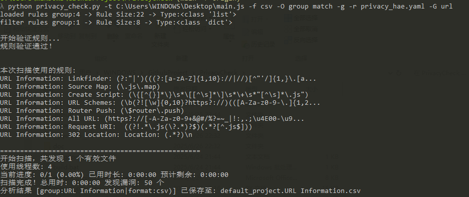
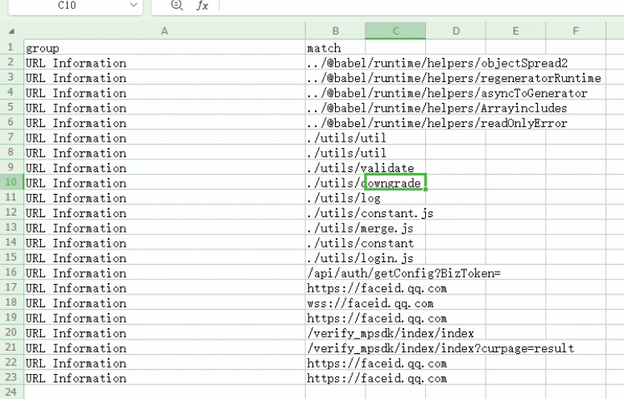

# privacy_check

直接兼容HAE规则的静态配置文件敏感信息提取(代码审计)工具


## 适用场景
1. 本地 网页源码、小程序源码、HTML源码等 敏感信息提取、URl信息提取 (完全类似离线版HAE提取)

## 程序优点 
1. 直接复用HAE规则 (目前仅采用 name、f_regex、sensitive、loaded)
2. 可以完全无依赖进行使用(需要携带yaml.py 注意yaml.py对于部分单引号规则的加载可能会出错)
3. 支持文件大小筛选、分片式读取, 节省内存占用
4. 支持多线程分析，加快运行速度 
5. 实时输出分析进度
6. 支持缓存记录功能,开启缓存后能够实现中断后继续扫描,避免大项目重复分析.
7. 支持大小写忽略选项，增加匹配结果数量 ignore_case (默认为True)
8. 支持上下文补充选项，扩充匹配结果长度 context_left|context_right

## 功能说明
- **规则文件**：通过 `-r 或 --rules` 指定用户自定义的检测规则，该文件格式可参考HAE配置 (privacy_hae.yaml) 和 默认规则(privacy_check.yaml).
- **多线程处理**：支持多线程扫描，提升扫描效率，默认使用与 CPU 核心数量相同的线程数。
- **缓存机制**：对于大型项目，启用 `-s 或 --save-cache` 可以定期保存扫描结果，防止程序中断导致数据丢失。
- **Chunk 模式**：适用于内存受限环境，通过分块读取文件降低内存占用，但会增加运行时间。
- **文件过滤**：可以通过 `-e 或 --exclude-ext` 排除特定后缀的文件，避免扫描非文本类文件。
- **敏感细心扫描**：若只关心高风险隐私信息，可启用 `-S 或 --sensitive` 参数。


### 参数说明
```
python privacy_check.py -h

Privacy information detection tool

options:
  -h, --help            show this help message and exit
  -r, --rules RULES_FILE
                        规则文件的路径(默认值：privacy_check.yaml)
  -t, --target TARGET   待扫描的项目目标文件或目录
  -p, --project-name PROJECT_NAME
                        项目名称, 影响默认输出文件名和缓存文件名
  -w, --workers WORKERS
                        工作线程数量(默认值：CPU 核心数)
  -l, --limit-size LIMIT_SIZE
                        检查文件大小限制 不超过 limit_size M
  -s, --save-cache      定时缓存扫描结果, 建议大项目使用 (默认: False) 注意:会生成缓存文件!!!
  -k, --chunk-mode      使用chunk模式读取文件,运行时间延长,内存占用减小 (默认: False)
  -e, --exclude-ext EXCLUDE_EXT [EXCLUDE_EXT ...]
                        排除文件扩展名(始终添加内置扩展名: {'.gz', '.woff', '.dll', '.bz2', '.bmp', '.7z', '.elf', '.pn
                        '.tiff', '.jpeg', '.woff2', '.tif', '.exe', '.zip', '.jpg', '.tar', '.rar', '.gif', '.tmp'})
  -S, --sensitive-only  只启用敏感信息规则 (sensitive: true) 默认False
  -N, --filter-names FILTER_NAMES [FILTER_NAMES ...]
                        仅启用name中包含指定关键字的规则, 多个关键字用空格分隔
  -G, --filter-groups FILTER_GROUPS [FILTER_GROUPS ...]
                        仅启用group中包含指定关键字的规则, 多个关键字用空格分隔
  -o, --output-file OUTPUT_FILE
                        指定输出文件路径 (默认：{project_name}.json)
  -g, --output-group    为规则组单独输出结果 (默认：False
  -O, --output-keys OUTPUT_KEYS [OUTPUT_KEYS ...]
                        仅输出结果中指定键的值，多个键使用空格分隔, 允许的键: {'rule_name', 'sensitive', 'group', 'matc
                        'context', 'file', 'line_number'}
  -f, --output-format {json,csv}
                        指定输出文件格式: json 或 csv, 默认: json
  -F, --format-results  对输出结果的每个值进行格式化，去除引号、空格等符号, 默认: True
  -b, --block-matches BLOCK_MATCHES [BLOCK_MATCHES ...]
                        对匹配结果中的match键值进行黑名单关键字列表匹配剔除, 建议在匹配较大项目时搭配缓存功能使用.
```

## 规则参数说明
    name: Cloud Key     #规则名称(必须填写)
    f_regex: (((access)(|-|_)(key)(|-|_)(id|secret))|(LTAI[a-z0-9]{12,20})) # 规则内容(必须填写)
    sensitive: true     # 是否敏感信息(默认False)
    loaded: true        # 是否启用规则(默认True)
    ignore_case: true   # 正则匹配时忽略大小写(默认True)
    context_left: 50    # 匹配结果 向左扩充50个字符 (sensitive规则默认50 非sensitive规则默认0)
    context_right: 50   # 匹配结果 向左扩充50个字符 (sensitive规则默认50 非sensitive规则默认0)
                        # context_left: 50 context_right: 50  表示在正则匹配结果后 向左右分别扩充50个字符

    # s_regex: ''         # HAE二次匹配规则 (未实现)
    # format: '{0}'       # HAE结果提取格式 (未实现)
    # color: gray         # HAE结果颜色显示 (未实现)
    # scope: response body# HAE规则匹配范围 (未实现)
    # engine: nfa         # HAE规则匹配引擎 (未实现)


## 使用示例






