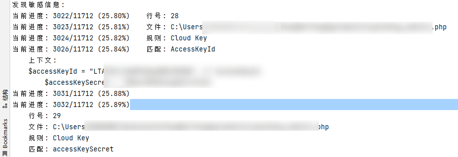

# privacy_check

直接兼容HAE规则的静态配置文件敏感信息提取(代码审计)工具

## 适用场景
1. 本地 网站|小程序|HTML 源码敏感配置审计（类似HAE提取）

## 程序优点 
1. 直接复用HAE规则 (目前仅采用 name、f_regex、sensitive、loaded)
2. 可以完全无依赖进行使用(需要携带yaml.py)
3. 分片式读取, 节省内存占用
4. 多线程分析，加快运行速度 
5. 分析进度实时输出
6. 支持缓存功能,开启缓存后能够实现中断后继续扫描,避免大项目重复分析.
7. 增加大小写忽略选项，增加匹配结果数量 ignore_case (默认为True)
8. 增加上下文补充选项，扩充匹配结果长度 context_left|context_right

## 规则参数说明
    name: Cloud Key     #规则名称(必须填写)
    f_regex: (((access)(|-|_)(key)(|-|_)(id|secret))|(LTAI[a-z0-9]{12,20})) # 规则内容(必须填写)
    sensitive: true     # 是否敏感信息(默认False)
    loaded: true        # 是否启用规则(默认True)
    ignore_case: true   # 正则匹配时忽略大小写(默认True)
    context_left: 50    # 匹配结果 向左扩充50个字符 (sensitive规则默认50 非sensitive规则默认0)
    context_right: 50   # 匹配结果 向左扩充50个字符 (sensitive规则默认50 非sensitive规则默认0)
                        # context_left: 50 context_right: 50  表示在正则匹配结果后 向左右分别扩充50个字符

    # s_regex: ''         # HAE二次匹配规则 (未实现)
    # format: '{0}'       # HAE结果提取格式 (未实现)
    # color: gray         # HAE结果颜色显示 (未实现)
    # scope: response body# HAE规则匹配范围 (未实现)
    # engine: nfa         # HAE规则匹配引擎 (未实现)

## 使用方式
    python privacy_check.py -h

### 参数说明

| 参数 | 简写 | 描述 | 默认值 |
|------|------|------|--------|
| `--rule-file` | `-r` | 规则配置文件路径 | `privacy_check.yaml` |
| `--target` | `-t` | 要扫描的目标文件或目录（必填） | 无 |
| `--project` | `-p` | 项目名称，影响默认输出文件名和缓存文件名 | 无 |
| `--output` | `-o` | 输出文件路径 | `output.json` |
| `--workers` | `-w` | 工作线程数 | CPU 核心数量 |
| `--limit-size` | `-l` | 设置检查文件大小上限（单位：MB） | 无 |
| `--save-cache` | `-s` | 定时缓存扫描结果，建议在大项目中使用（注意：会生成缓存文件） | False |
| `--chunk-mode` | `-k` | 使用 chunk 模式读取文件，运行时间延长但内存占用减小 | False |
| `--exclude-ext` | `-e` | 排除指定后缀的文件（默认已排除以下格式：{'.exe', '.bin', '.gif', '.woff', '.elf', '.bz2', '.gz', '.woff2', '.tar', '.zip', '.jpeg', '.jpg', '.tiff', '.dll', '.7z', '.png', '.tif', '.rar', '.tmp', '.bmp'}) | 无 |
| `--sensitive-only` | `-S` | 仅扫描敏感规则 | False |

## 功能说明

- **规则文件**：通过 `-r 或 --rule-file` 指定用户自定义的检测规则，该文件格式请参考HAE配置.
- **目标扫描**：可指定单个文件或整个目录进行扫描。
- **多线程处理**：支持多线程扫描，提升扫描效率，默认使用与 CPU 核心数量相同的线程数。
- **缓存机制**：对于大型项目，启用 `-s 或 --save-cache` 可以定期保存扫描结果，防止程序中断导致数据丢失。
- **Chunk 模式**：适用于内存受限环境，通过分块读取文件降低内存占用，但会增加运行时间。
- **文件过滤**：可以通过 `-e 或 --exclude-ext` 排除特定后缀的文件，避免扫描非文本类文件。
- **敏感细心扫描**：若只关心高风险隐私信息，可启用 `-S 或 --sensitive-only` 参数。

## 使用示例

